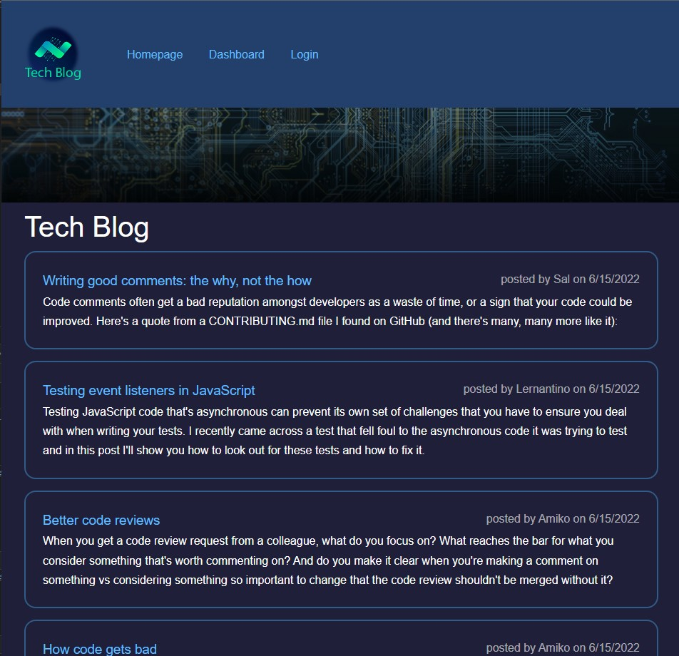
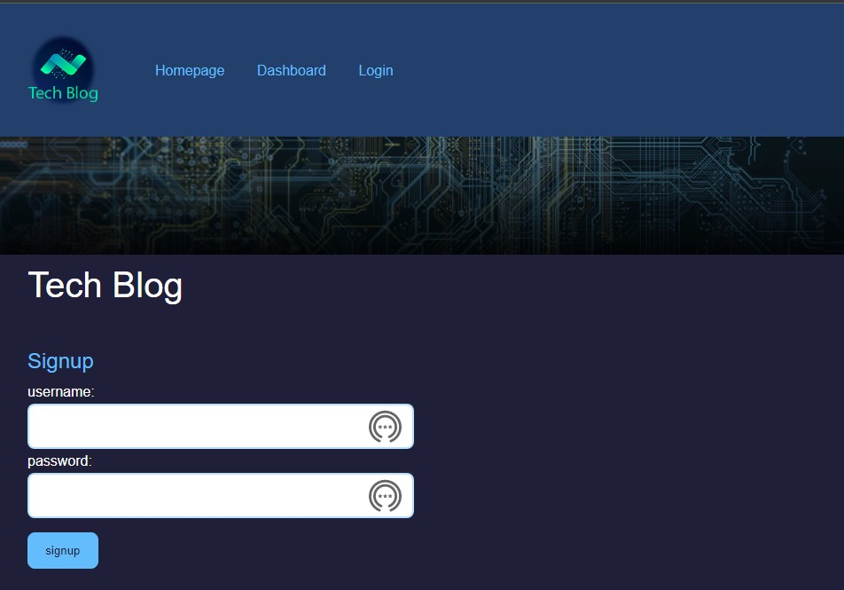
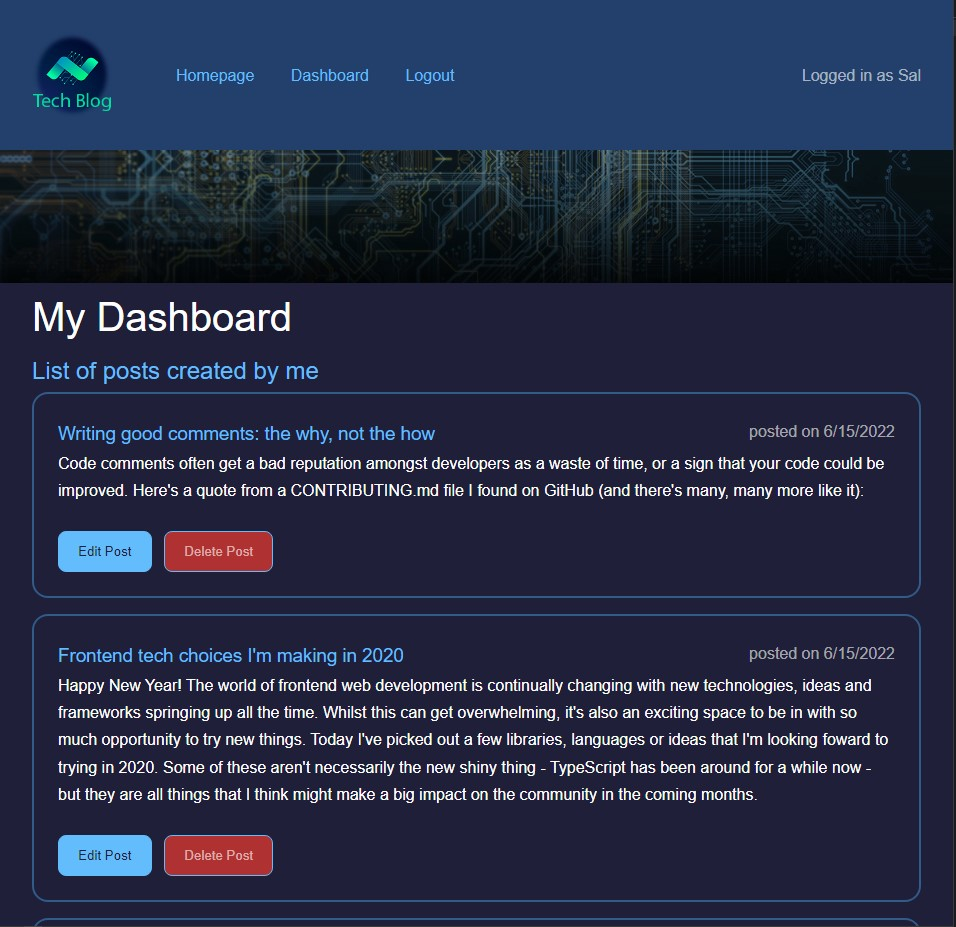
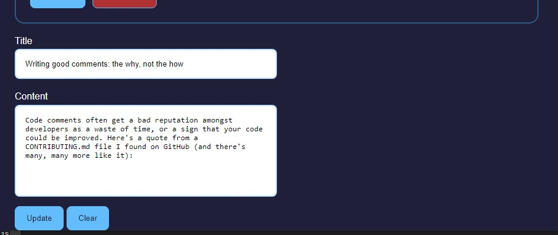
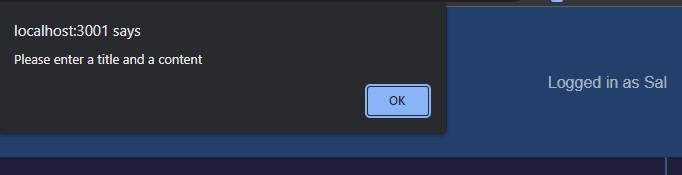
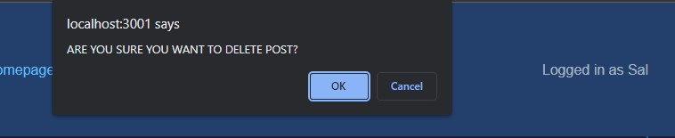
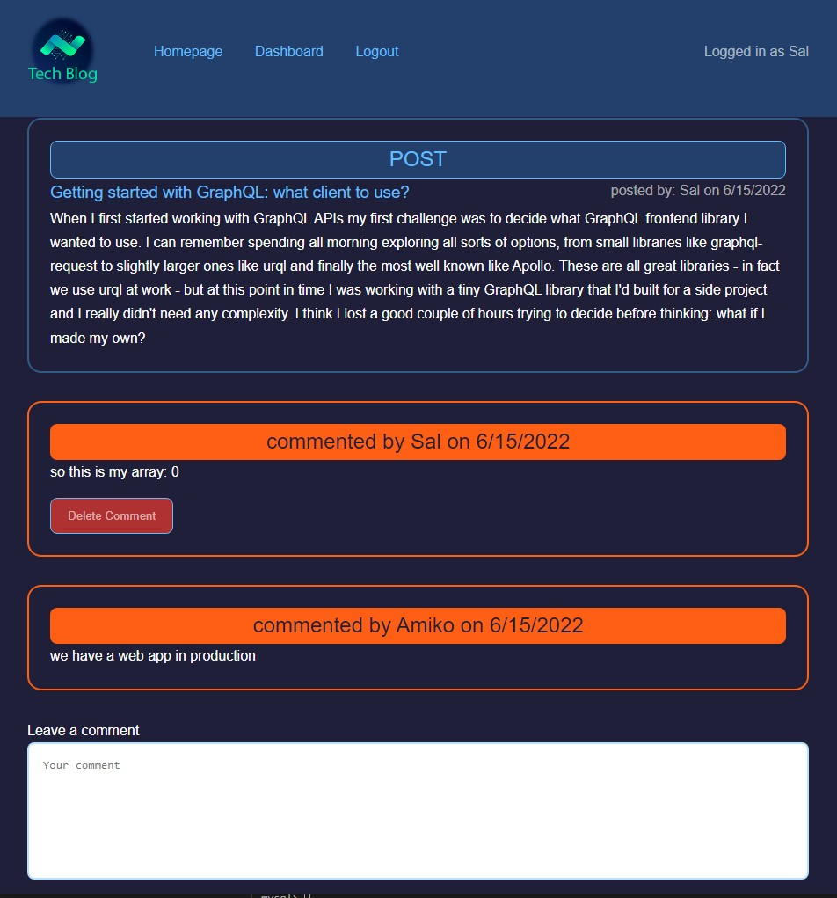
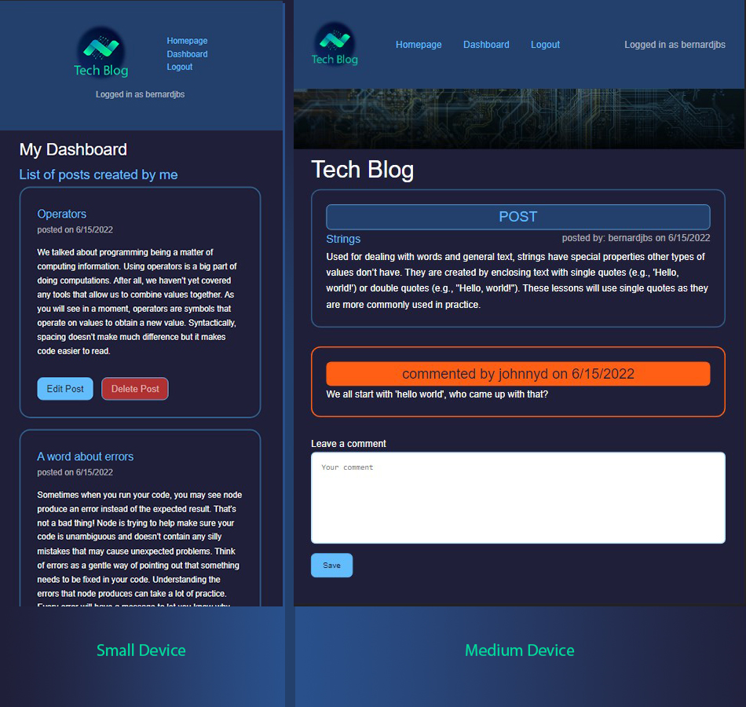

# Tech Blog Website

## Description
This is a tech blog CMS style website where developers can publish their blogs and comment on other developers' posts as well. Signed up users have the option to perform CRUD operations to their posts and comments. The technologies used to build this web application are: 
- NodeJS
- Sequelize
- bcrypt
- Express
- Express Handlebars
- MySQL
- Sessions

## Usage
The top navigation bar has the following links: 
- Homepage
- Dashboard
- Login

## Homepage
The homepage gives a list of all post made by users starting from the most recent. Each post contains: 
- The title
- The Content
- Date when the post was created
- The username of the post owner

## Login
A user can login their blog account or sign up to the blog if they do not have an account. When a user is logged in, the login link is changed to logout. 

## Dashboard
When a user logs in or signs up, they are directed to their dashboard. The dashboard has a list of posts created by the logged in user. The user has the option to edit and update or delete their posts, and to view a post by clicking on the post title. The username is displayed at the top right corner. 

## Edit an existion post
When the Edit Post button is clicked, the page scrolls down and the title and content will be placed in their corresponding input and text fields, ready to be edited and updated.  

When the Update button is pressed, the dashboard page is reloaded with the updated post. 

### Validation handling: 
-  If title and/or content fields are empty, an message alert will open and will prevent the user from updating. 

- When the Delete Post button is pressed, a confirmation alert is popped to confirm if the user's intention is to delete their post. 

## Viewing an existing post
From the homepage or dashboard, a logged in user can add comments on the listed posts. Click on the title and a page will load with comments for the post. If a comment belongs to the logged in user, he has the option to delete it. A confirmation message will prompt when the delete button is pressed. When the user starts typing, a clear button will show. The clear button clears the text field, should the user choose to start over typing. The clear button hides when the text field is empty. After typing the comment, the Save button is pressed to save and refresh the page with the newly saved comment. If the field is empty, an alert message will pop and prevent the user from saving a comment.  

## Session
The website includes a session cookie which expires if the user is inactive for 60 seconds. 

## Responsiveness
The website is responsive on small and medium devices

## Link to deployed application
[Visit Site: Tech Blog](https://tech-blog-wk14.herokuapp.com/)

